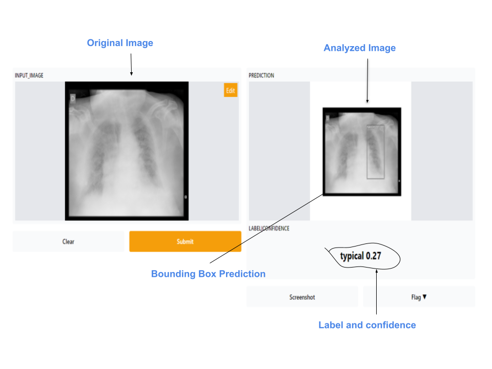
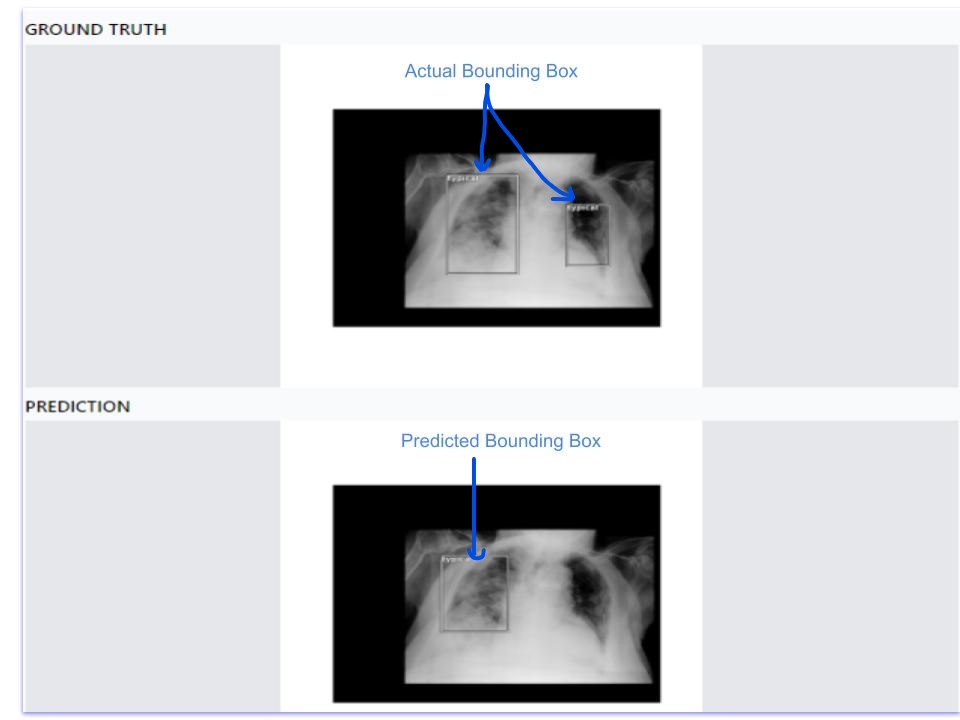

# Pneumonia Detection App

Detect Pneumonia in Chest X Rays using Object Detection Model. The model is built using Yolov5 (https://github.com/ultralytics/yolov5). The application is capable of detecting bounding boxes and conditions associated with the scan. The application uses Gradio (https://gradio.app/) for developing the UI. This is suitable for the scenario for quick experimentation when we need to make our model(s) available to end users.

The dataset used here is BIMCV COVID-19+ (https://www.kaggle.com/c/siim-covid19-detection/data).

Following is a snapshot of the interface.

## Set Up

git clone https://github.com/ultralytics/yolov5

git clone https://github.com/sinharitesh/app-pneumonia-detection.git

cd app-pneumonia-detection

pip install -r requirements.txt

## Run App

The app can run in couple of modes - Normal and Debug. Debug mode helps the end user in observing the output and do the comparison. 

python app.py 

python app.py --mode debug

Note: The app has sample image files provided, so if you are looking to run this yourself , just go and follow the above steps, you will have this app running in no time.

The interface looks as following when it is run in debug mode.

## Citation

### Dataset

The BIMCV-COVID19 Data used by this challenge were originally published by the Medical Imaging Databank of the Valencia Region (BIMCV) in cooperation with The Foundation for the Promotion of Health and Biomedical Research of Valencia Region (FISABIO), and the Regional Ministry of Innovation, Universities, Science and Digital Society (Generalitat Valenciana), however the images were completely re-annotated using different annotation types. Users of this data must abide by the BIMCV-COVID19 Dataset research Use Agreement. Paper Reference: BIMCV COVID-19+: a large annotated dataset of RX and CT images from COVID-19 patients

The MIDRC-RICORD Data used by this challenge were originally published by The Cancer Imaging Archive. The images were re-annotated for this challenge using a different annotation schema. Users of this data must abide by the TCIA Data Usage Policy and the Creative Commons Attribution-NonCommercial 4.0 International License under which it has been published. Attribution should include references to citations listed on the TCIA citation information page (page bottom). Paper Reference: The RSNA International COVID-19 Open Radiology Database (RICORD)

### Yolov5
https://github.com/ultralytics/yolov5/

### Gradio
@article{abid2019gradio,
title={Gradio: Hassle-Free Sharing and Testing of ML Models in the Wild},
author={Abid, Abubakar and Abdalla, Ali and Abid, Ali and Khan, Dawood and Alfozan, Abdulrahman and Zou, James},
journal={arXiv preprint arXiv:1906.02569},
year={2019}
}
